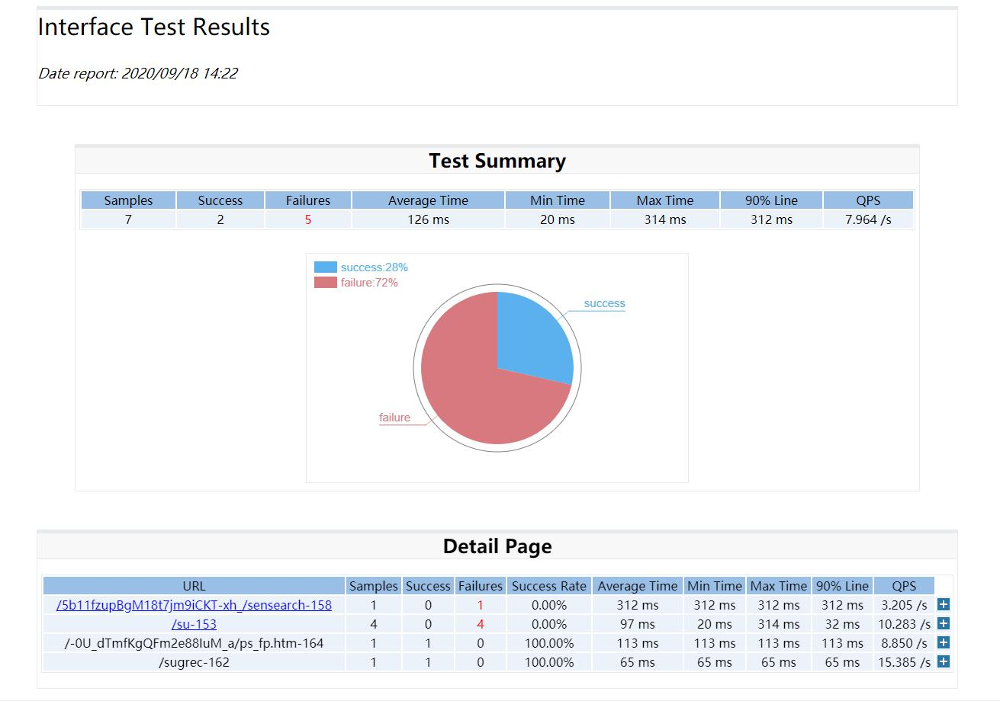
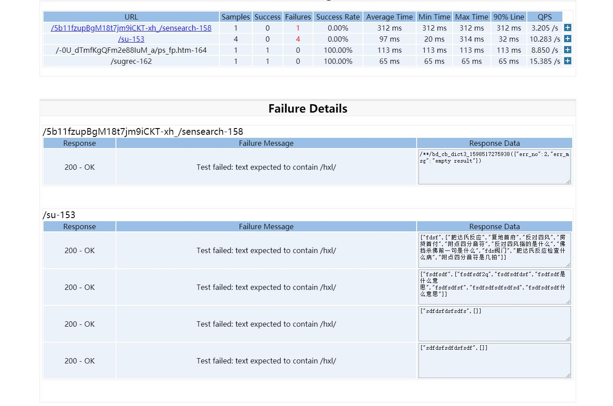

# jmeter
该仓库应用于jmeter的学习和引用

## jmeter-results-report_hxl.xsl
通过xsl文件将jmeter的jtl文件输出html文件  
使用方法：  
* 在ant的build文件中，修改style文件路径：  
```xml
<xslt
    classpathref="xslt.classpath"
    force="true"
    in="${jmeter.result.jtlName}"
    out="${jmeter.result.summary.htmlName}"
    style="${xsl.dir}/jmeter-results-report_hxl.xsl">
    <param name="dateReport" expression="${report.datestamp}"/>
</xslt>
```
* 或者在jtl文件中第二行添加如下代码，直接用浏览器打开
```xml
<?xml-stylesheet type="text/xsl" href="jmeter-results-report_hxl.xsl"?>
```

输出的例图如下：  


